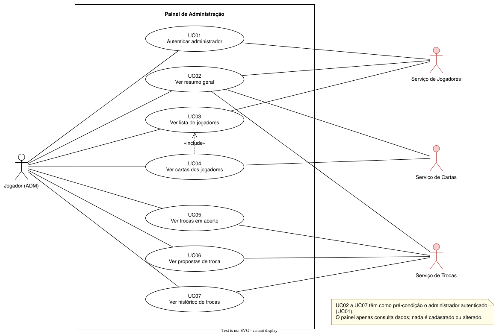

# 02 – Casos de Uso

**Atores**
- **Jogador (ADM)**: ator principal. É o jogador com perfil de administrador.
- **Serviço de Jogadores, Serviço de Cartas e Serviço de Trocas**: atores secundários. São
  outros sistemas que interagem com o painel a partir da fronteira dele (Cap. 2).

**Relacionamentos**
- **Associação:** liga cada ator aos casos de uso de que participa.
- **`«include»`:** UC04 inclui UC03, porque para mostrar as cartas o painel reaproveita a busca
  de jogadores para exibir o nick do dono de cada carta.
- **Fronteira do sistema:** o retângulo "Painel de Administração" separa o que é do painel do
  que é dos outros grupos.

---

## Documentação dos casos de uso (fluxo de eventos)

### UC01 – Autenticar administrador

| Campo | Descrição |
|---|---|
| **Descrição** | O jogador informa login e senha. O painel confirma com o Serviço de Jogadores que ele tem perfil ADMIN. |
| **Requisitos** | RF01, RNF01 |
| **Atores** | Jogador (ADM); Serviço de Jogadores |
| **Pré-condições** | O Serviço de Jogadores está disponível. |
| **Pós-condições** | O administrador tem uma sessão válida e vê o resumo geral. |
| **Cenário básico** | 1. O ADM informa login e senha. 2. O painel envia as credenciais ao Serviço de Jogadores. 3. O serviço devolve a sessão com o perfil `ADMIN`. 4. O painel abre o resumo geral (UC02). |
| **Cenários alternativos** | **A1 – Credenciais inválidas:** o painel mostra "login ou senha inválidos" e volta ao passo 1. **A2 – Perfil diferente de ADMIN:** o painel mostra "acesso negado" e volta ao passo 1. **A3 – Serviço indisponível:** o painel mostra um aviso de erro. |

### UC02 – Ver resumo geral

| Campo | Descrição |
|---|---|
| **Descrição** | Mostra os totais da plataforma: jogadores, cartas, trocas em aberto, propostas pendentes e trocas finalizadas. |
| **Requisitos** | RF02 |
| **Atores** | Jogador (ADM); Serviços de Jogadores, Cartas e Trocas |
| **Pré-condições** | ADM autenticado (UC01). |
| **Pós-condições** | Os totais aparecem na tela. |
| **Cenário básico** | 1. O ADM acessa a página inicial do painel. 2. O painel busca os jogadores, as cartas, as trocas e as propostas nos serviços. 3. O painel calcula os totais. 4. O painel mostra o resumo. |
| **Cenários alternativos** | **A1 – Um serviço não respondeu:** o painel mostra os totais que conseguiu, marca o restante como "indisponível" e exibe um aviso. |

### UC03 – Ver lista de jogadores

| Campo | Descrição |
|---|---|
| **Descrição** | Lista os jogadores cadastrados com a quantidade de cartas de cada um. |
| **Requisitos** | RF03 |
| **Atores** | Jogador (ADM); Serviço de Jogadores; Serviço de Cartas |
| **Pré-condições** | ADM autenticado (UC01). |
| **Pós-condições** | A lista de jogadores aparece na tela. |
| **Cenário básico** | 1. O ADM acessa a aba **Jogadores**. 2. O painel busca os jogadores no Serviço de Jogadores. 3. O painel busca as cartas no Serviço de Cartas e conta quantas cada jogador possui. 4. O painel mostra nick, e-mail, data de cadastro e quantidade de cartas. |
| **Cenários alternativos** | **A1 – Nenhum jogador cadastrado:** mostra "nenhum jogador encontrado". **A2 – Serviço indisponível:** mostra um aviso de erro. |

### UC04 – Ver cartas dos jogadores

| Campo | Descrição |
|---|---|
| **Descrição** | Mostra as cartas que cada jogador possui no momento, agrupadas por jogador. |
| **Requisitos** | RF04, RNF04 |
| **Atores** | Jogador (ADM); Serviço de Jogadores; Serviço de Cartas |
| **Pré-condições** | ADM autenticado (UC01). |
| **Pós-condições** | As cartas aparecem agrupadas por jogador. |
| **Cenário básico** | 1. O ADM acessa a aba **Cartas**. 2. O painel busca os jogadores, reaproveitando UC03 (`«include»`). 3. O painel busca todas as cartas em **uma única consulta**. 4. O painel agrupa as cartas por jogador. 5. Para cada jogador, mostra o nick e as cartas (nome, tipos e imagem do Pokémon). |
| **Cenários alternativos** | **A1 – Jogador sem cartas:** mostra "sem cartas" no grupo dele. **A2 – Serviço indisponível:** mostra um aviso de erro. |

### UC05 – Ver trocas em aberto

| Campo | Descrição |
|---|---|
| **Descrição** | Lista as cartas colocadas para troca que ainda não foram finalizadas. |
| **Requisitos** | RF05 |
| **Atores** | Jogador (ADM); Serviço de Trocas; Serviço de Jogadores |
| **Pré-condições** | ADM autenticado (UC01). |
| **Pós-condições** | A lista de trocas em aberto aparece na tela. |
| **Cenário básico** | 1. O ADM acessa a aba **Trocas em aberto**. 2. O painel busca as trocas com status ABERTA no Serviço de Trocas. 3. O painel busca os jogadores para mostrar o nick do ofertante. 4. O painel calcula há quanto tempo cada troca está aberta. 5. O painel mostra ofertante, carta oferecida, tempo em aberto e quantidade de propostas. |
| **Cenários alternativos** | **A1 – Nenhuma troca aberta:** mostra "nenhuma troca em aberto". **A2 – Serviço indisponível:** mostra um aviso de erro. |

### UC06 – Ver propostas de troca

| Campo | Descrição |
|---|---|
| **Descrição** | Lista as propostas feitas pelos jogadores para as trocas em andamento. |
| **Requisitos** | RF06 |
| **Atores** | Jogador (ADM); Serviço de Trocas; Serviço de Jogadores |
| **Pré-condições** | ADM autenticado (UC01). |
| **Pós-condições** | A lista de propostas aparece na tela. |
| **Cenário básico** | 1. O ADM acessa a aba **Propostas**. 2. O painel busca as propostas no Serviço de Trocas. 3. O painel busca os jogadores para mostrar os nicks. 4. O painel mostra troca, proponente, carta proposta, status e data. |
| **Cenários alternativos** | **A1 – Filtrar por status:** o ADM escolhe PENDENTE, ACEITA ou RECUSADA e a lista mostra só essas propostas. **A2 – Serviço indisponível:** mostra um aviso de erro. |

### UC07 – Ver histórico de trocas

| Campo | Descrição |
|---|---|
| **Descrição** | Lista as trocas já finalizadas. |
| **Requisitos** | RF07 |
| **Atores** | Jogador (ADM); Serviço de Trocas; Serviço de Jogadores |
| **Pré-condições** | ADM autenticado (UC01). |
| **Pós-condições** | O histórico aparece em ordem da mais recente para a mais antiga. |
| **Cenário básico** | 1. O ADM acessa a aba **Histórico**. 2. O painel busca as trocas com status FINALIZADA no Serviço de Trocas. 3. O painel busca os jogadores para mostrar os nicks. 4. O painel ordena por data de finalização. 5. O painel mostra data, ofertante, quem recebeu e as cartas trocadas. |
| **Cenários alternativos** | **A1 – Nenhuma troca finalizada:** mostra "nenhuma troca finalizada". **A2 – Serviço indisponível:** mostra um aviso de erro. |
