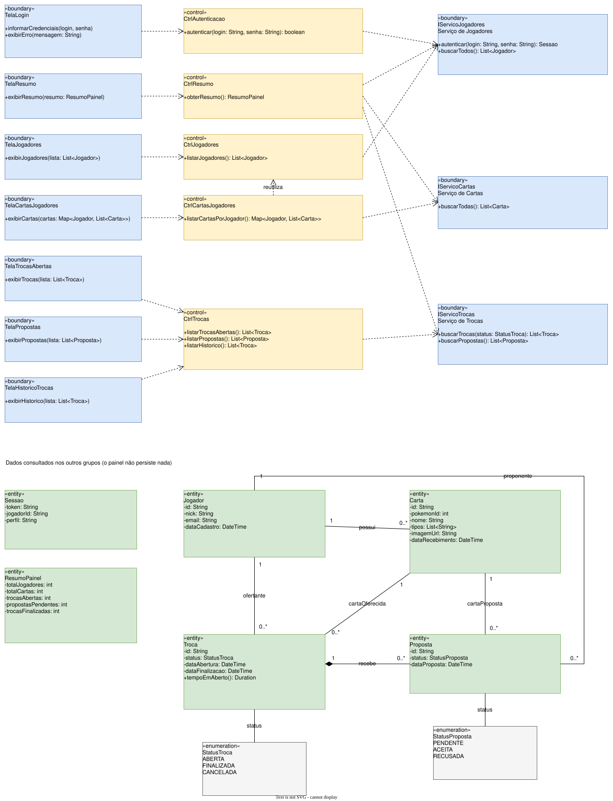

# 03 – Diagrama de Classes (classes de análise)

O diagrama está no **nível de projeto** (Cap. 2): mostra nome, atributos, métodos e
relacionamentos. As classes foram encontradas a partir do fluxo de cada caso de uso e
classificadas com os estereótipos de classes de análise. As cores são as mesmas em todos os
diagramas:

| Estereótipo | Cor | No painel |
|---|---|---|
| **«boundary»** (fronteira) | azul | Comunicação entre o caso de uso e o ator. São as **telas** (`TelaLogin`, `TelaJogadores`…), uma por caso de uso. Também as **fronteiras com os outros sistemas**: `IServicoJogadores`, `IServicoCartas` e `IServicoTrocas`. O Cap. 2 inclui APIs como fronteira. |
| **«control»** (controle) | amarelo | "Ponte" entre fronteira e entidade, com a lógica de cada caso de uso. Por exemplo, `CtrlCartasJogadores` agrupa as cartas por jogador. |
| **«entity»** (entidade) | verde | As informações: `Jogador`, `Carta`, `Troca`, `Proposta`, que vêm dos outros grupos, e `Sessao` e `ResumoPainel`, que o painel monta. O painel **não persiste** nenhuma delas. |

## Conceitos de orientação a objetos aplicados (Cap. 0)

- **Encapsulamento:** atributos `-` (private) e métodos `+` (public), seguindo a regra geral do
  Cap. 0.
- **Interface como contrato:** `IServicoJogadores`, `IServicoCartas` e `IServicoTrocas` dizem
  **o que** cada serviço oferece. Os controles usam só esse contrato, sem conhecer **como** o
  serviço é acessado (abstração).
- **DTO:** as entidades só carregam os dados recebidos dos outros grupos, no estilo JavaBean/DTO
  visto no Cap. 0.
- **Reuso:** `CtrlCartasJogadores` **reutiliza** `CtrlJogadores` para obter os nicks.

## Relacionamentos entre as entidades (Cap. 2)

| Relação | Tipo | Multiplicidade | Significado |
|---|---|---|---|
| Jogador **possui** Carta | associação | 1 → 0..* | um jogador tem várias cartas; cada carta tem um dono atual |
| Troca → Jogador (**ofertante**) | associação | 0..* → 1 | quem colocou a carta para troca |
| Troca → Carta (**cartaOferecida**) | associação | 0..* → 1 | carta colocada para troca |
| Troca ◆ **recebe** Proposta | **composição** | 1 → 0..* | a proposta só existe dentro de uma troca: se a troca deixa de existir, as propostas também |
| Proposta → Jogador (**proponente**) | associação | 0..* → 1 | quem fez a proposta |
| Proposta → Carta (**cartaProposta**) | associação | 0..* → 1 | carta oferecida em troca |
| Troca / Proposta → **StatusTroca / StatusProposta** | associação com enumeração | 1 | situação da troca e da proposta |

As linhas tracejadas com seta aberta entre telas, controles e fronteiras indicam
**dependência**: uma classe usa a outra.
