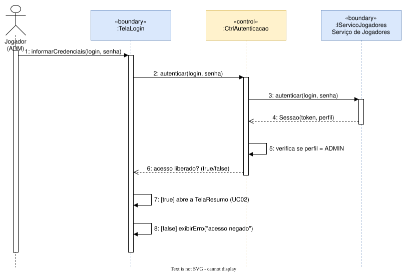
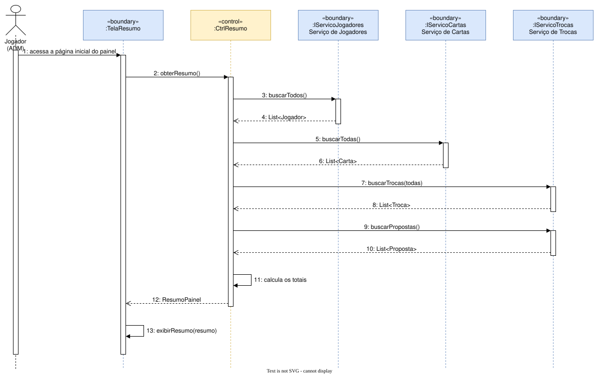
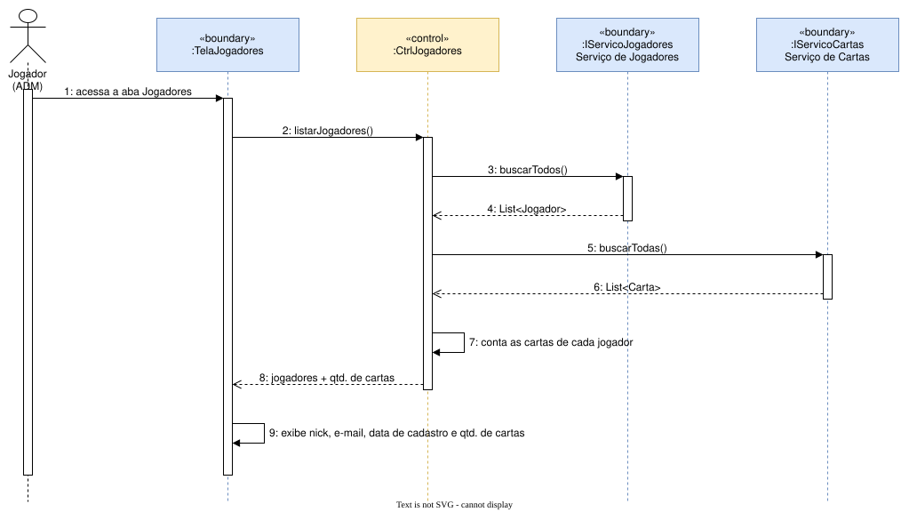
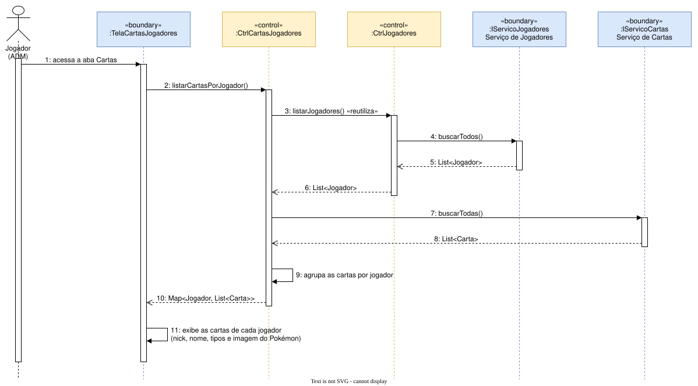
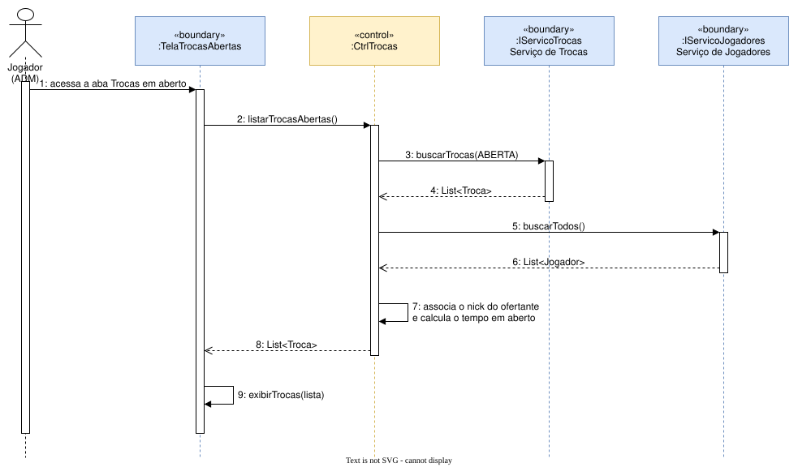
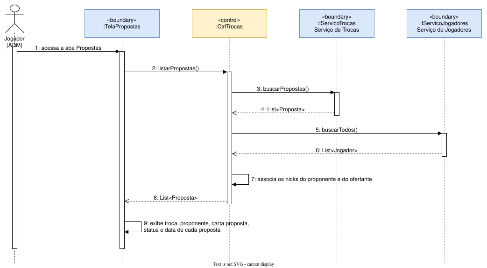
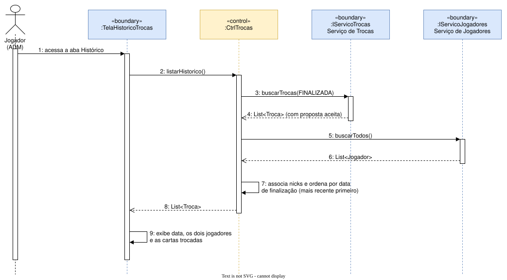

# 04 – Diagramas de Sequência

Um diagrama por caso de uso, como modelo explicativo do cenário básico. Elementos usados:

| Elemento | Como aparece |
|---|---|
| **Ator** | Jogador (ADM), que inicia o fluxo |
| **Linhas de vida** | objetos «boundary», «control» e «entity» do [diagrama de classes](../03-diagrama-de-classes/README.md) |
| **Foco de controle (ativação)** | retângulo sobre a linha de vida enquanto o objeto executa um método |
| **Mensagem síncrona** | seta cheia: chamada de método |
| **Mensagem de retorno** | seta tracejada: resposta da chamada |
| **Auto-mensagem** | seta que volta para o próprio objeto, por exemplo "agrupa as cartas por jogador" |
| **Condição de guarda** | `[true]` / `[false]` em SQ01: a mensagem só acontece se a condição for verdadeira |

| Diagrama | Caso de uso |
|---|---|
| [SQ01 – Autenticar administrador](#sq01--autenticar-administrador) | UC01 |
| [SQ02 – Ver resumo geral](#sq02--ver-resumo-geral) | UC02 |
| [SQ03 – Ver lista de jogadores](#sq03--ver-lista-de-jogadores) | UC03 |
| [SQ04 – Ver cartas dos jogadores](#sq04--ver-cartas-dos-jogadores) | UC04 |
| [SQ05 – Ver trocas em aberto](#sq05--ver-trocas-em-aberto) | UC05 |
| [SQ06 – Ver propostas de troca](#sq06--ver-propostas-de-troca) | UC06 |
| [SQ07 – Ver histórico de trocas](#sq07--ver-histórico-de-trocas) | UC07 |

## SQ01 – Autenticar administrador
O controle verifica o perfil e devolve se o acesso foi liberado. As **condições de guarda**
`[true]` e `[false]` decidem se a tela abre o resumo ou mostra "acesso negado".

## SQ02 – Ver resumo geral
O controle consulta os três serviços e calcula os totais.

## SQ03 – Ver lista de jogadores

## SQ04 – Ver cartas dos jogadores
`CtrlCartasJogadores` reutiliza `CtrlJogadores`. As cartas são buscadas em **uma única
consulta** e agrupadas no painel.

## SQ05 – Ver trocas em aberto

## SQ06 – Ver propostas de troca

## SQ07 – Ver histórico de trocas

