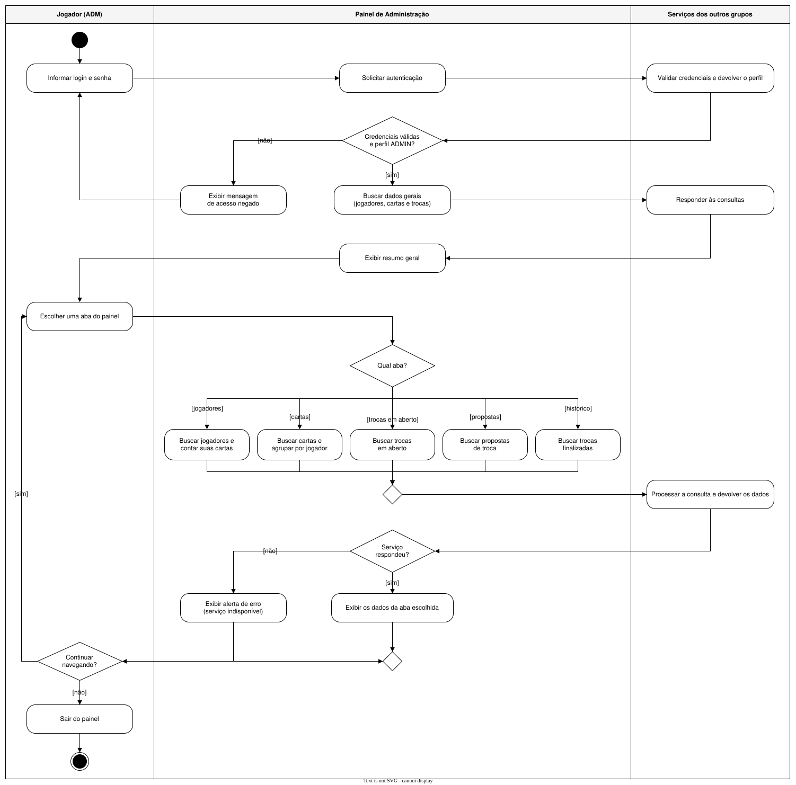

# 05 – Diagrama de Atividades

O diagrama descreve o fluxo de controle do uso do painel, do login até a saída. Elementos
usados:

| Elemento | No diagrama |
|---|---|
| **Estado inicial e final** | círculo preto no início e círculo com borda no fim |
| **Estado de ação** | retângulos arredondados, por exemplo "Informar login e senha" |
| **Transição** | setas entre as ações |
| **Ponto de decisão + condição de guarda** | losangos com `[sim]` / `[não]` e com o nome de cada aba |
| **Raias (swimlanes)** | dividem as responsabilidades entre o ADM, o painel e os serviços dos outros grupos |

| Raia | Responsabilidade |
|---|---|
| **Jogador (ADM)** | entra com login e senha, escolhe a aba, decide continuar ou sair |
| **Painel de Administração** | decide o que buscar, junta os dados e mostra o resultado ou o aviso de erro |
| **Serviços dos outros grupos** | validam as credenciais (Jogadores) e respondem às consultas (Jogadores, Cartas e Trocas) |

**Principais pontos de decisão**
1. **Credenciais válidas e perfil ADMIN?** Se não, mostra "acesso negado" e volta ao login.
2. **Qual aba?** Jogadores, cartas, trocas em aberto, propostas ou histórico.
3. **Serviço respondeu?** Se não, mostra um aviso de erro sem travar o painel (RNF03).
4. **Continuar navegando?** Volta para a escolha de aba ou sai do painel.
