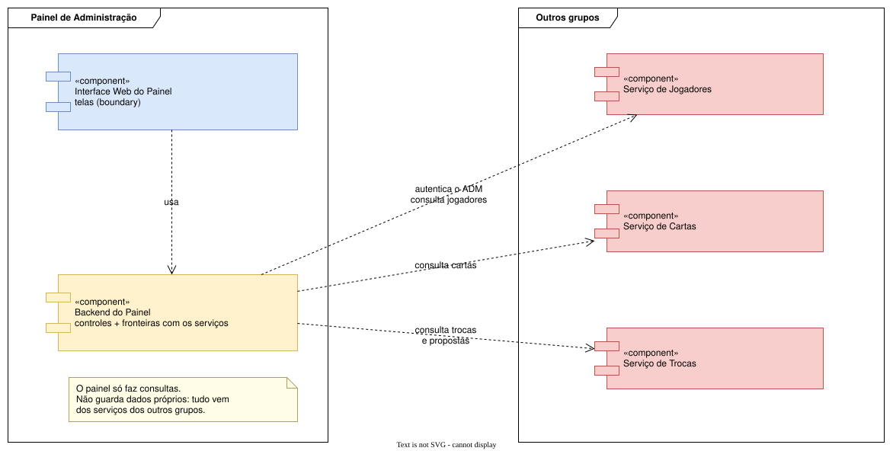
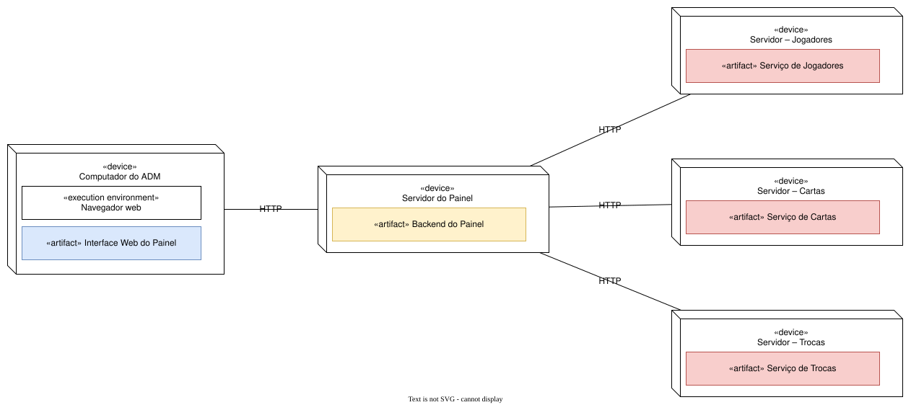

# 06 – Arquitetura

Visão global do sistema (Cap. 1) representada com os diagramas estruturais da UML (Cap. 2).

## Diagrama de componentes

Mostra as partes do software, sua organização e as dependências entre elas.

| Componente | Responsabilidade |
|---|---|
| **Interface Web do Painel** | as telas («boundary») que o administrador usa |
| **Backend do Painel** | os controles («control») e as fronteiras com os serviços dos outros grupos |
| **Serviços de Jogadores, Cartas e Trocas** | componentes dos outros grupos, que fornecem os dados |

## Diagrama de implantação

Mostra como e onde o sistema é implantado: os dispositivos, o que roda em cada um e como eles
se comunicam.

## Decisões e trade-offs (Cap. 1)

| Decisão | Alternativa considerada | Motivo da escolha |
|---|---|---|
| Ter um **backend próprio do painel** entre as telas e os outros serviços | As telas consultarem direto os serviços dos outros grupos | (+) Um único lugar junta os dados e conhece os serviços dos outros grupos. (+) As telas recebem os dados prontos. (−) É mais um componente para implantar. |
| Buscar as cartas com **uma consulta** e agrupar no painel | Uma consulta por jogador | Com N jogadores, seriam N+1 consultas. Uma só é mais rápida e menos sujeita a falhas (RNF04). |
| Painel **somente leitura**, sem banco próprio | Copiar os dados para um banco do painel | Evita dados duplicados e desatualizados. A informação sempre vem do grupo responsável. |
